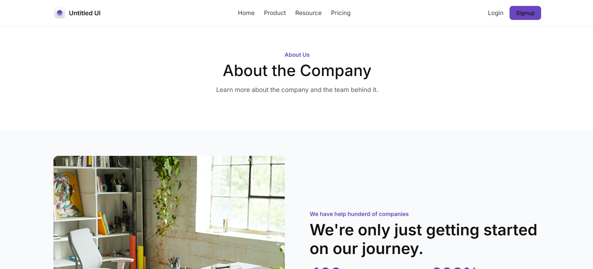

# KraftPixel Project Assesment

This is a frontend web project built using **HTML** and **CSS**.

## 📂 Project Structure
- `index.html` – Main entry point of the website.
- `css/style.css` – Stylesheet for the website.
- `images/` – Contains image assets used in the project.
- `.txt` – Placeholder text file.

## 🚀 How to Run
1. Clone this repository or download the project files.
2. Open `index.html` in your web browser to view the website.

## 🛠️ Technologies Used
- **HTML5**
- **CSS3**

## 📷 Preview

---
✨ Built with ❤️ by Sunil Sahoo
